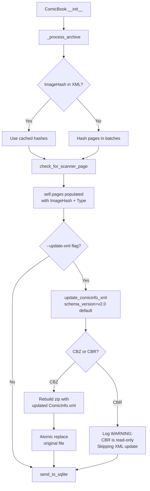

# Proposal — `update_comicinfo_xml()` Method

**Status:** Proposal only — no code changes made  
**Author:** Agent  
**Date:** 2026-08-16

---

## 1. Problem Statement

Currently, `ComicBook` computes several expensive or corrective pieces of data during `__init__`:

1. **Per-page image hashes** — computed by `_process_archive` using a `ThreadPoolExecutor`. For a 30-page comic this can take several seconds.
2. **Scanner page detection** — compares each page hash against `scanner_hash.json`.
3. **Double-page detection** — inferred from image dimensions in the XML.
4. **Publisher normalisation** — corrected in-memory by `_correct_xml()`.

None of this computed data is written back to the source archive. On the next run over the same file, all of it must be recomputed from scratch. Corrections (publisher name, scanner page `Type="Deleted"`, double-page flags) exist only for the duration of one scan.

---

## 2. Proposed Solution

Add a new method `update_comicinfo_xml()` to `ComicBook` that optionally writes computed and corrected data back into the archive's `ComicInfo.xml` **before** calling `send_to_sqlite()`.

This is an **opt-in** operation, controlled by a `--update-xml` CLI flag (default: off). The output schema version is also configurable — defaulting to **v2.0** with an opt-in to **v2.1**.

---

## 3. Schema Version Support (v2.0 and v2.1)

### 3.1 Side-by-Side Diff

| Element / Attribute           | v2.0                             | v2.1                            | Notes                                                      |
| ----------------------------- | -------------------------------- | ------------------------------- | ---------------------------------------------------------- |
| `<Translator>`                | ❌ absent                        | ✅ added                        | After `<Editor>`                                           |
| `<Tags>`                      | ❌ absent                        | ✅ added                        | After `<Genre>` — free-form tag string                     |
| `<StoryArcNumber>`            | ❌ absent                        | ✅ added                        | After `<StoryArc>` — issue number within an arc            |
| `<GTIN>`                      | ❌ absent                        | ✅ added                        | After `<Review>` — Global Trade Item Number (ISBN/barcode) |
| `CommunityRating` precision   | `fractionDigits=2` (e.g. `4.75`) | `fractionDigits=1` (e.g. `4.8`) | Values with 2 d.p. are invalid in v2.1                     |
| `ComicPageType` (`Type` attr) | `xs:list` of enumerations        | `xs:list` of enumerations       | Unchanged — space-separated multi-value possible in both   |
| `DoublePage` attr on `<Page>` | `xs:boolean` (`true`/`false`)    | `xs:boolean` (`true`/`false`)   | Unchanged between versions                                 |

### 3.2 Default: v2.0

v2.0 is the stable, widely-supported release. All existing reading applications (Komga, Kavita, YACReader, etc.) are built against it. **v2.0 is the default output format.**

v2.1 is still a draft. It should be opt-in only.

### 3.3 What v2.1 Output Adds

When writing v2.1, the serialiser would additionally include:

- `<Translator>` — not currently tracked in `XML_data` or `TAG_MAPPING`. Would be read-through only (if present in the original XML, preserve it; do not synthesise it).
- `<Tags>` — not currently tracked. Same read-through policy.
- `<StoryArcNumber>` — not currently tracked. Same read-through policy.
- `<GTIN>` — not currently tracked. Same read-through policy.
- `CommunityRating` rounded to 1 decimal place before writing.

Full v2.1 write support (synthesising `Translator`, `Tags`, etc.) would require additions to `XML_data`, `TAG_MAPPING` in `get_data_from_xml()`, and potentially the database schema. That is out of scope for this proposal and tracked as a follow-on.

### 3.4 `DoublePage` Handling

`DoublePage` is `xs:boolean` in both v2.0 and v2.1 — written as `"true"` / `"false"`. No version-specific handling is required.

The in-memory page dict stores `"DoublePage": "True"` / `"DoublePage": "False"` (capitalised strings from XML attribute parsing). The serialiser should normalise these to lowercase `"true"` / `"false"` to be strictly XSD-compliant in both versions.

### 3.5 `ComicPageType` as a List

In both versions, `ComicPageType` is an `xs:list` — meaning `Type` can hold multiple space-separated values, e.g. `Type="FrontCover Story"`. The current codebase treats it as a single value. The serialiser should preserve the existing `Type` string as-is when writing, rather than trying to split or validate it.

---

## 4. What Gets Written Back

### 4.1 Per-Page `ImageHash` (primary motivation)

The `self.pages` list already holds per-page dicts after `check_for_scanner_page()` runs. Each dict looks like:

```python
{
    "Image": "0",
    "ImageWidth": "1988",
    "ImageHeight": "3057",
    "ImageSize": "2134840",
    "Type": "FrontCover",
    "DoublePage": "False",
    "FilePath": "page_000.jpg",
    "ImageHash": "f8e0c0f0e8d0c8b0"   # computed by _process_archive, not in the original XML
}
```

`ImageHash` would be written onto each `<Page>` element as a non-standard attribute. On future runs, the hash is read from the XML and the hashing step is skipped entirely for that page.

`ImageHash` is not in either the v2.0 or v2.1 XSD. The recommendation is to add it directly as a custom attribute — it is descriptive, consistent with the in-memory naming, and readers tolerate unknown attributes silently.

### 4.2 Scanner Page Type

`_tag_scanner_page()` already sets `page["Type"] = "Deleted"` in memory. Writing the XML back persists this so readers that honour `ComicInfo.xml` can skip the scanner page automatically. `"Deleted"` is a valid `ComicPageType` enumeration value in both v2.0 and v2.1.

### 4.3 Double-Page Flag

`_extract_pages()` currently sets `page["Type"] = "DoublePage"` in memory. `"DoublePage"` is **not** a valid `ComicPageType` enumeration value in either schema version. The correct XSD-compliant representation is the `DoublePage` attribute on the `<Page>` element.

When writing back, the serialiser should:

- Set `DoublePage="true"` on the affected `<Page>` element (consistent across both schema versions).
- Leave `Type` as `"Story"` (or its existing value) rather than writing `"DoublePage"`.

The in-memory representation in `_extract_pages()` should also be corrected as part of the implementation (tracked in Open Questions).

### 4.4 Corrected Publisher Name

`_correct_xml()` normalises the publisher string. The corrected value could be written back to `<Publisher>`. This modifies original metadata rather than adding computed data, so it is gated behind a separate `--update-publisher` flag.

---

## 5. Hash-Skip Optimisation (Future Runs)

The main performance benefit. Flow on **first run** vs **subsequent run**:

### First Run (no hashes in XML)

```
_process_archive()
  ├─ read xml_bytes
  ├─ parse <Page> elements → no ImageHash attributes found
  ├─ extract_pages() → full page list
  └─ hash all pages in batches (ThreadPoolExecutor)  ← expensive

update_comicinfo_xml()  ← writes hashes back to XML inside archive
```

### Subsequent Run (hashes present in XML)

```
_process_archive()
  ├─ read xml_bytes
  ├─ parse <Page> elements → ImageHash attributes found for all pages
  ├─ extract_pages() → page list
  └─ skip hashing entirely — use cached hashes from XML            ← free
```

This requires one addition to `_process_archive`: after reading `xml_bytes`, parse the `<Pages>` section and extract any pre-existing `ImageHash` attributes into a `cached_hashes: dict[str, str]` map. The hashing loop then checks `cached_hashes` before submitting a page to the executor.

Partial caching works naturally — if only some pages have hashes (e.g. hashing was interrupted), only the unhashed pages are processed.

---

## 6. Data Flow Diagram



---

## 7. Method Signature and Behaviour

```python
def update_comicinfo_xml(
    self,
    schema_version: str = "2.0",
    update_publisher: bool = False,
) -> None:
    """
    Writes computed data back into the archive's ComicInfo.xml.

    Always writes:
      - ImageHash attribute on each <Page> element (non-standard, both versions)
      - Corrected DoublePage attribute on each <Page> element
        Both versions: DoublePage="true"/"false"  (xs:boolean, unchanged)
      - Type="Deleted" on scanner pages (valid in both versions)

    Optionally writes (if update_publisher=True):
      - Corrected <Publisher> text using publisher_mapping

    schema_version:
      "2.0" (default) — writes a v2.0-compliant ComicInfo.xml.
                         v2.1-only fields are omitted even if present.
      "2.1"            — writes a v2.1 ComicInfo.xml. Includes Translator,
                         Tags, StoryArcNumber, GTIN if present in source.
                         CommunityRating rounded to 1 d.p.

    Only supported for CBZ archives. CBR archives are skipped with a
    WARNING log. PDF files have no embedded ComicInfo.xml and are skipped.

    Uses an atomic write pattern:
      1. Write updated zip to <original>.cbz.tmp
      2. os.replace(<original>.cbz.tmp, <original>.cbz)
      3. On any error: delete temp file, log ERROR, re-raise
    """
```

---

## 8. CLI Integration

New flags on the `scan` command:

```
--update-xml / --no-update-xml    Write computed hashes and page annotations
                                  back into each archive's ComicInfo.xml.
                                  Default: no-update-xml.

--comicinfo-version [2.0|2.1]     Schema version for the written ComicInfo.xml.
                                  Default: 2.0.

--update-publisher                When used with --update-xml, also correct
                                  the <Publisher> field using the publisher
                                  mapping. Default: False.
```

Config file equivalents:

```yaml
update_xml: false
comicinfo_version: "2.0" # "2.0" or "2.1"
update_publisher: false
```

---

## 9. CBZ Write Strategy (Atomic Zip Rebuild)

Python's `zipfile` module does not support in-place modification. The safe approach is a full rebuild:

```
1. Open original CBZ (read mode)
2. For each member: read bytes into memory (or stream — see note below)
3. Replace ComicInfo.xml bytes with the freshly serialised XML
4. Write all members to a new zip at <original_path>.cbz.tmp
5. Close both zip handles
6. os.replace("<original>.cbz.tmp", "<original>.cbz")
   └─ atomic on POSIX; MoveFileEx on Windows
7. logger.debug("XML updated: <filename>")
```

On failure at any step: delete the `.tmp` file if it exists, log an ERROR, continue to the next comic. The original file is never touched until step 6.

For memory efficiency with large archives (hundreds of MB), step 2 can stream each member directly from the old zip to the new zip using `shutil.copyfileobj` rather than loading all pages into RAM simultaneously.

---

## 10. CBR Limitation

`rarfile` is read-only in Python. For CBR files, `update_comicinfo_xml()` logs a `WARNING` and returns early. The existing `cbr_to_cbz.py` converter stub is the natural place to handle pre-processing if the user wants write-back for CBR collections.

---

## 11. XML Serialisation Notes

The existing `get_data_from_xml()` uses `xml.etree.ElementTree`. The write-back uses the same library.

### Element ordering

Both XSDs define a strict element sequence. The serialiser must write elements in XSD order. v2.1-only elements (`Translator`, `Tags`, `StoryArcNumber`, `GTIN`) are appended only when `schema_version="2.1"`.

### Page attribute preservation

When updating `<Page>` attributes, iterate the existing attribute dict and update only the attributes being set (`ImageHash`, `DoublePage`, `Type`). Preserve all others (`Key`, `Bookmark`, `ImageSize`, `ImageWidth`, `ImageHeight`) exactly as found.

### `DoublePage` (both versions)

`DoublePage` is `xs:boolean` in both v2.0 and v2.1. Normalise the in-memory capitalised string to lowercase on write:

```python
# Both versions — xs:boolean, normalise to lowercase
page_elem.set("DoublePage", "true" if is_double else "false")
```

### `CommunityRating` per version

```python
# v2.0 — up to 2 decimal places (e.g. 4.75)
# v2.1 — max 1 decimal place (e.g. 4.8); round before writing
if schema_version == "2.1" and rating is not None:
    rating = round(float(rating), 1)
```

### Non-standard `ImageHash` attribute

Should be written with a brief XML comment above the `<Pages>` block to make its origin clear to anyone inspecting the file:

```xml
<!-- ImageHash attributes added by cbscripts for scan deduplication -->
<Pages>
    <Page Image="0" Type="FrontCover" ImageHash="f8e0c0f0e8d0c8b0" ... />
    ...
</Pages>
```

---

## 12. Impact on `send_to_sqlite`

**None.** `send_to_sqlite` reads from `self.pages` which is already populated in memory. The XML update is a pure side-effect that persists data to disk.

---

## 13. Impact on `_process_archive` (Hash-Skip)

One addition required: after reading `xml_bytes`, parse the `<Pages>` section and extract any pre-existing `ImageHash` attributes into `cached_hashes: dict[str, str]` keyed by page filename. The hashing loop checks `cached_hashes` before submitting a page to the executor.

The change is confined to `_process_archive` and does not affect the public interface of `ComicBook`.

---

## 14. Summary of Affected Files

| File                            | Change Required                                                                                    |
| ------------------------------- | -------------------------------------------------------------------------------------------------- |
| `comic_class.py`                | Add `update_comicinfo_xml()`; modify `_process_archive()` to read cached hashes from XML           |
| `scan_dir.py`                   | Call `comic.update_comicinfo_xml()` when flag is set, before `send_to_sqlite()`                    |
| `cli.py`                        | Add `--update-xml`, `--comicinfo-version`, `--update-publisher` flags to `scan` command            |
| `config_data.py` / `ConfigData` | Add `update_xml: bool`, `comicinfo_version: str`, `update_publisher: bool` fields                  |
| `xml_dataclass.py`              | Add `translator`, `tags`, `story_arc_number`, `gtin` fields for full v2.1 read support (follow-on) |
| `comic_class.py` `TAG_MAPPING`  | Add v2.1 field mappings (follow-on, alongside `xml_dataclass.py`)                                  |
| `RECOMMENDATIONS.md`            | Add new entry once implemented                                                                     |

No changes to `sql_statements.py` or the asset files for the initial implementation.

---

## 15. Open Questions Before Implementation

1. **`DoublePage` in-memory fix** — `_extract_pages()` currently sets `Type="DoublePage"` (non-standard). Should this be corrected at the same time as implementing write-back, changing it to set the `DoublePage` key in the page dict instead? This would affect `check_for_scanner_page()` and any code that reads `page["Type"]`.

2. **Memory vs streaming for zip rebuild** — for collections with very large comics (300+ MB), is in-memory rebuild acceptable or should streaming copy be used? Streaming is safer but slightly more complex.

3. **CBR conversion** — should `--update-xml` automatically trigger CBR → CBZ conversion (using the converter stub once implemented), or remain a separate manual step?

4. **Stale hash detection** — if a comic's page count changes between scans (new page added, page removed), cached hashes in the XML will be stale. Safest heuristic: if the number of `<Page>` elements in the XML does not match the number of image files in the archive, discard all cached hashes and rehash from scratch.

5. **Full v2.1 field support** — `Translator`, `Tags`, `StoryArcNumber`, and `GTIN` are not tracked anywhere in the current codebase. Should these be added to `XML_data`, `TAG_MAPPING`, and the database schema as a separate task before implementing v2.1 write support?

6. **`DoublePage` normalisation** — the in-memory dict stores `"True"` / `"False"` (Python-capitalised strings from XML attribute parsing). Should normalisation to lowercase `"true"` / `"false"` happen in `_extract_pages()` at parse time, or only at write time in `update_comicinfo_xml()`?
